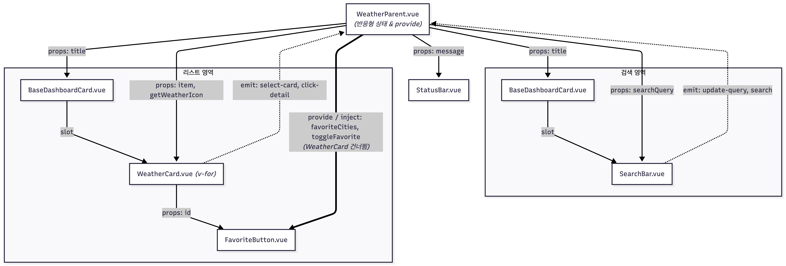

# skala-vue

skala vue 연습 공간입니다.

---

## Handson: WeatherMockup

`src/components/practices/basic/handson/WeatherMockup.vue`를 실습하면서 아래 내용을 하나씩 추가했습니다.

- **카드 스타일**: 텍스트만 나열되니 뭘 만들고 있는지 감이 잘 안 왔습니다. Claude의 도움을 받아 예시 화면과 비슷한 느낌으로 초기 화면을 꾸며봤습니다.
- **카드 목록 스크롤 처리**: 도시 데이터를 하나둘 늘렸더니 카드가 길어지면서 맨 아래 상태바가 화면 밖으로 밀려나 안 보이는 문제가 생겼습니다. 전체를 다 보여주기보다 카드 영역만 스크롤되게 바꿔서 해결했습니다.
- **Enter 키 검색 실행**: 처음엔 입력할 때마다 바로 반응하게 했습니다. 그런데 검색처럼 무거워질 수 있는 동작은 매번 실행할 필요가 없겠다 싶었습니다. 그래서 입력값은 실시간으로 갱신하되, 실제 검색은 Enter를 눌렀을 때만 실행되도록 나눠봤습니다. 이 과정에서 `.enter` 수식어로 특정 키에만 반응하는 리스너를 연습해봤습니다.
- **날씨 아이콘 이미지**: 날씨 상태가 계속 텍스트로만 보여서 좀 밋밋하다고 느꼈습니다. 상태값에 따라 아이콘 이미지가 자동으로 바뀌면 더 와닿을 것 같아서, 상태 → 이미지 URL을 매핑하는 함수를 만들고 `:src`에 바인딩해봤습니다. 단순 값이 아니라 함수 결과를 동적으로 연결하는 `v-bind` 활용을 연습해봤습니다.

---

## Handson: WeatherComposition

`src/components/practices/basic/handson/WeatherComposition.vue`는 WeatherMockup을 기반으로 이어서 만든 컴포넌트입니다. 아래 내용을 하나씩 추가했습니다.

- **즐겨찾기 기능**: 카드마다 별 아이콘을 눌러 즐겨찾기를 토글하는 기능을 추가했습니다.
  - 반응형 상태: 즐겨찾기한 도시 id를 담는 `favoriteCities` ref를 새로 선언했습니다.
  - computed: `favoriteWeatherList`로 즐겨찾기된 도시 정보만 따로 뽑아서 목록 헤더에 즐겨찾기 개수를 보여줍니다.
  - watcher: `favoriteCities`를 `watch`로 감시해서 즐겨찾기 목록이 바뀔 때마다 콘솔 로그를 남기도록 했습니다.

```js
// 반응형 상태: 즐겨찾기한 도시 id 목록
const favoriteCities = ref([])
const toggleFavorite = (id) => {
  favoriteCities.value = favoriteCities.value.includes(id)
    ? favoriteCities.value.filter((favId) => favId !== id)
    : [...favoriteCities.value, id]
}

// computed: 검색 필터링 + 즐겨찾기된 도시를 맨 위로 정렬
const filteredWeatherList = computed(() => {
  const query = searchQuery.value.trim()
  const list = query
    ? weatherList.value.filter((item) => item.name.includes(query))
    : weatherList.value

  return [...list].sort((a, b) => {
    const aFav = favoriteCities.value.includes(a.id) ? 1 : 0
    const bFav = favoriteCities.value.includes(b.id) ? 1 : 0
    return bFav - aFav
  })
})

// computed: 즐겨찾기된 도시 정보만 모아서 개수/목록으로 가공
const favoriteWeatherList = computed(() =>
  weatherList.value.filter((item) => favoriteCities.value.includes(item.id)),
)

// watcher: 즐겨찾기 목록이 바뀔 때마다 콘솔로 알림
watch(favoriteCities, (newList) => {
  console.log(`⭐ [watch 감지] 즐겨찾기 목록이 변경되었습니다 -> 총 ${newList.length}곳`)
})
```

### 트러블슈팅: 즐겨찾기해도 목록 맨 위로 안 올라가던 문제

즐겨찾기 버튼을 눌러도 카드 순서가 그대로였습니다. 원인을 보니 `filteredWeatherList` computed가 `searchQuery`와 `weatherList`만 읽고 있었습니다. 그래서 Vue 입장에서는 이 computed가 `favoriteCities`와는 아무 연관이 없는 값이었습니다. computed는 함수 내부에서 실제로 `.value`를 읽은 반응형 변수만 의존성으로 추적하기 때문에, 즐겨찾기 상태가 바뀌어도 재계산이 트리거되지 않았던 것입니다.

해결은 `filteredWeatherList` 내부에서 정렬 로직을 추가하면서, 정렬 기준으로 `favoriteCities.value.includes(...)`를 직접 읽게 만든 것이었습니다. 이 한 줄이 추가되자 computed가 `favoriteCities`도 자동으로 의존성에 포함시켰습니다. 그 결과 즐겨찾기를 토글할 때마다 `filteredWeatherList`가 다시 계산되면서 즐겨찾기된 카드가 자연스럽게 맨 위로 정렬됐습니다.

### CSS 분리: 공통/외부 CSS 적용 방법

프로젝트 전체 공통 스타일은 `main.js`에 등록하고, 특정 컴포넌트 전용 스타일은 `<style>` 안에서 `@import`로 가져온다는 방식을 적용해봤습니다. WeatherComposition은 WeatherMockup을 기반으로 이어서 만든 컴포넌트라, 애초에 같은 기반 위에서 출발한 만큼 `<style>` 블록도 공통된 부분이 많았습니다. 그래서 두 컴포넌트가 공유하는 기반 스타일은 `weather-card.css`로 뽑아서 같이 import했습니다. 즐겨찾기처럼 새로 추가한 스타일만 `weather-composition.css`로 따로 뒀습니다. `@import`는 `scoped` 안에서는 효과가 없다는 걸 알게 되어 `scoped`는 지우고 사용했습니다.

---

## Handson: WeatherComponent (컴포넌트 분리)

`src/components/practices/basic/handson/WeatherParent.vue`는 WeatherComposition 하나에 몰려있던 코드를 기능 변경 없이 여러 컴포넌트로 쪼갠 버전입니다.

### 요구사항대로 나눈 4개 컴포넌트

- **WeatherParent.vue**: 도시 목록, 검색어, 즐겨찾기 등 모든 반응형 상태와 로직을 그대로 들고 있습니다. 자식 컴포넌트들은 표시와 이벤트 전달만 담당하고, 실제 상태 변경은 전부 여기서 처리합니다.
- **BaseDashboardCard.vue**: 검색박스/리스트박스가 배경, 둥근 모서리, 여백까지 똑같은 디자인을 쓰고 있길래 공통 카드 레이아웃으로 뽑았습니다. `title` prop과 기본 슬롯만 있고, 실제 내용은 slot으로 부모가 채워 넣습니다.
- **SearchBar.vue**: 검색어를 표시만 하고, 입력/엔터가 발생하면 `update-query` / `search` 이벤트로 부모에게 알립니다.
- **WeatherCard.vue**: 도시 하나의 정보를 표시하고, 카드 선택/상세보기 동작을 각각 `select-card` / `click-detail` 이벤트로 부모에게 올려보냅니다. 즐겨찾기는 아래 Provide/Inject 항목처럼 WeatherCard를 거치지 않고 별도로 처리됩니다.

### 요구사항 외에 추가로 나눈 컴포넌트

- **StatusBar.vue**: 하단 상태 문구는 `message` prop 하나만 받아서 보여주는 게 전부라, 가장 단순하게 분리할 수 있는 부분이었습니다.
- **FavoriteButton.vue**: WeatherCard 안에 즐겨찾기 별 버튼 로직이 섞여 있어서, WeatherCard를 더 얇게 만들기 위해 따로 뺐습니다. 아래 Provide/Inject 항목에서 다루듯, 이 컴포넌트는 즐겨찾기 상태를 WeatherCard가 아니라 WeatherParent와 직접 주고받습니다.

### Provide/Inject: 즐겨찾기 상태

처음엔 `getWeatherIcon` 함수를 WeatherParent가 provide하고 WeatherCard가 inject하는 식으로 짜봤는데, 생각해보니 WeatherCard는 slot 내용이라 BaseDashboardCard를 거치지 않고 WeatherParent 스코프에서 바로 컴파일되는 직계 자식이었습니다. 즉 몇 단계를 건너뛰는 상황이 아니라 그냥 props를 대체한 것뿐이라 provide/inject를 억지로 쓴 셈이었습니다.

그래서 진짜로 조상 손자 관계인 지점을 찾아서 옮겼습니다. `FavoriteButton.vue`는 WeatherCard의 진짜 자식(WeatherParent 기준으로는 손자)이라, 여기서 WeatherCard를 건너뛰고 최상위 WeatherParent의 즐겨찾기 상태(`favoriteCities`)와 변경 함수(`toggleFavorite`)를 직접 주입받도록 바꿨습니다. FavoriteButton은 이제 도시 `id`만 prop으로 받고, 즐겨찾기 여부 판단과 토글 요청을 전부 inject한 값으로 직접 처리합니다. 대신 `getWeatherIcon`은 원래대로 WeatherParent → WeatherCard에 평범한 prop으로 내렸습니다.

```js
// WeatherParent.vue
provide('favoriteCities', readonly(favoriteCities))
provide('toggleFavorite', toggleFavorite)
```

```js
// FavoriteButton.vue (WeatherCard를 건너뛰고 WeatherParent에서 바로 주입)
const favoriteCities = inject('favoriteCities')
const toggleFavorite = inject('toggleFavorite')
const isFavorite = computed(() => favoriteCities.value.includes(props.id))
```

### 컴포넌트 간 Props / Emit 흐름

https://mermaid.ai/app/dashboard 를 이용해서 각 컴포넌트 간 흐름도를 작성했습니다.


---

## Handson: Weather Router

`/weather-app` 경로 아래에 WeatherComponent를 Vue Router 기반 다중 페이지 구조로 확장한 버전입니다.

라우터 지연 로딩은 원래 `src/router/index.js`에 있던 모든 라우트가 이미 `component: () => import(...)` 형태였어서, 새로 추가한 `/weather-app` 계열 라우트도 그 관례를 그대로 따라 지연 로딩으로 등록했습니다. Catch-all Route는 `/:pathMatch(.*)*` 패턴으로 `NotFoundView.vue`를 연결했고, Vue Router는 routes 배열에 등록된 순서대로 매칭을 시도하기 때문에 이 라우트를 배열 맨 마지막에 둬서 다른 라우트에 안 걸리는 경로만 여기로 떨어지게 했습니다. App.vue의 Navigation Bar와 `<RouterView />`는 이미 처음부터 있던 구조라 손댈 게 없었고, 이번엔 Handson 목록에 "날씨 Vue Router 앱" 링크 하나만 추가해서 진입점을 열어뒀습니다.

WeatherHomeView.vue는 WeatherParent.vue의 반응형 상태와 로직을 거의 그대로 옮겨왔고, 상세보기 버튼을 눌렀을 때 기존의 `window.alert()` 호출을 지우고 `router.push()`로 상세 페이지(`/weather-app/weather/:cityId`)로 이동하도록 바꿨습니다. WeatherDetailView.vue는 `onMounted` 시점에 라우트 파라미터 `route.params.cityId`를 읽어서 `weatherMockData` 배열에서 해당 도시 객체를 찾아 화면에 뿌려주는 식으로 만들었습니다. WeatherAboutView.vue는 이 프로젝트가 어떤 흐름으로 만들어졌는지 소개하는 문구와 "대시보드 홈으로 이동" 버튼을 넣었고, 추가 view로는 즐겨찾기한 도시만 모아 보여주는 WeatherFavoritesView.vue를 만들어서 `/weather-app/favorites`로 라우팅했습니다.

### 트러블 슈팅: 왜 `/`가 아니라 `/weather-app`인지

과제 요구사항 에서는 WeatherHomeView를 `/` 경로에 두라고 되어 있는데, 저는 `/weather-app`에 뒀습니다. 솔직히 말하면 이 프로젝트의 `/` 경로가 지금까지 실습한 모든 Code Challenge/Handson 링크를 모아둔 야매(?) 홈 화면 역할을 하고 있어서, 여기를 WeatherHomeView로 갈아치우면 지금까지 쌓아온 다른 실습 페이지로 가는 진입로가 전부 없어지는 상황이었습니다. 그래서 기존 라우터 구조를 건드리지 않는 선에서 `/weather-app`을 이번 과제만의 새 루트로 잡고, 그 밑에 `/weather-app/about`, `/weather-app/favorites`, `/weather-app/weather/:cityId`를 매달았습니다. Catch-all Route만 앱 전체에 공통으로 걸리는 전역 라우트라 그대로 뒀습니다.

---

## Handson: Weather Store

`/weather-store` 경로 아래에 Pinia로 상태를 관리하는 버전을 새로 만들었습니다. 과제 예시는 단위(°C/°F) 설정을 `configStore.js`로 관리하는 것이었는데, 저는 그 대신 기상청이 실제로 쓰는 체감온도 산출식을 계절별로 계산해주는 Store를 만들어봤습니다. 여름철은 기온+습도, 겨울철은 기온+풍속을 쓰는 완전히 다른 공식이라 계절이 바뀔 때마다 어떤 공식을 쓸지 상태로 들고 있어야 했고, 이게 마침 Pinia store가 하기 딱 좋은 일이라 생각했습니다.

### feelsLikeStore.js: 계절별 체감온도 계산

`season`이라는 state 하나에 `'summer' | 'winter'`를 담아두고, `calculateFeelsLike(city)`가 이 상태를 보고 두 공식 중 하나를 골라 계산합니다. 여름철 공식은 습구온도(Tw)가 먼저 필요한데, 기상자료개방포털 공식에는 상대습도만 주어져 있어서 Stull(2011)의 근사식으로 습구온도부터 구한 다음 체감온도 공식에 넣었습니다. 겨울철 공식은 기온이 10℃를 넘거나 풍속이 1.3m/s보다 느리면 애초에 산출 대상이 아니라서, 조건을 만족 못 하면 `null`을 반환하도록 했습니다. 처음엔 `setSeason(value)`로 두 버튼 중 하나를 고르는 식으로 만들었는데, 과제 예시(configStore의 `toggleUnit`)가 버튼 하나로 두 상태를 스위칭하는 방식이라 그에 맞춰 `toggleSeason()` 하나로 여름철/겨울철을 오가도록 바꿨습니다. 라벨 표시용으로 `unitSymbol`에 대응하는 `seasonLabel` getter도 추가했습니다.

```js
// stores/feelsLikeStore.js
export const useFeelsLikeStore = defineStore('feelsLike', () => {
  const season = ref('summer')
  const seasonLabel = computed(() =>
    season.value === 'summer' ? '☀️ 여름철 공식' : '❄️ 겨울철 공식',
  )
  const toggleSeason = () => {
    season.value = season.value === 'summer' ? 'winter' : 'summer'
  }

  const calculateFeelsLike = ({ temp, humidity, windSpeed }) => {
    if (season.value === 'summer') {
      const tw = calcWetBulb(temp, humidity) // Stull 근사식
      return -0.2442 + 0.55399 * tw + 0.45535 * temp - 0.0022 * tw ** 2 + 0.00278 * tw * temp + 3.0
    }
    if (temp > 10 || windSpeed < 1.3) return null // 겨울철 산출 조건 미충족
    const windKmh = windSpeed * 3.6
    const v016 = Math.pow(windKmh, 0.16)
    return 13.12 + 0.6215 * temp - 11.37 * v016 + 0.3965 * v016 * temp
  }

  return { season, seasonLabel, toggleSeason, calculateFeelsLike }
})
```

### SeasonToggler.vue: Navigation Bar 옆에 배치

`체감 공식: 여름철` 같은 현재 상태 표시 영역과 `계절변경` 버튼을 한 세트로 묶어서, `WeatherAppHeader.vue`의 `<nav>` 안 "ℹ️ 서비스 소개" 바로 뒤에 나란히 넣었습니다. `WeatherAppHeader.vue`는 홈/즐겨찾기/소개/상세 페이지가 전부 공유하는 컴포넌트라, 이 토글도 페이지를 옮겨 다녀도 항상 같은 위치(Navigation Bar 옆)에 떠 있습니다.

```vue
<!-- SeasonToggler.vue -->
<div style="display: inline-flex; align-items: center; gap: 8px">
  <span>체감 공식: <strong>{{ feelsLikeStore.season === 'summer' ? '☀️ 여름철' : '❄️ 겨울철' }}</strong></span>
  <button @click="feelsLikeStore.toggleSeason" class="toggle-btn">계절변경</button>
</div>
```

버튼을 처음엔 "여름철 공식"/"겨울철 공식" 버튼 두 개를 나란히 두고 클릭한 쪽을 활성화하는 식으로 테스트 했었었는데, 과제 예시(UnitToggler.vue: `configStore.toggleUnit`)가 라벨 하나 + 토글 버튼 하나로 상태를 스위칭하는 방식이라 그 구조를 그대로 가져와서 지금 형태로 바꿨습니다.

### 메인/상세에 똑같이 적용

WeatherCard.vue(메인 목록)와 WeatherStoreDetailView.vue(상세 페이지) 둘 다 `useFeelsLikeStore()`로 store를 직접 구독해서 같은 `calculateFeelsLike()`를 그대로 호출합니다. "메인/상세에 적용하면 코드가 중복되니 Composable로 해결 가능하다(범위 제외)"는 참고가 있었는데, 계산 로직 자체를 store 하나에 몰아넣고 나니 두 화면은 그냥 store를 불러다 쓰기만 하면 돼서 자연스럽게 중복이 생기지 않았습니다.

### 트러블슈팅: 습구온도(Tw)를 구할 방법이 없던 문제

여름철 공식은 기온(Ta)과 습구온도(Tw)가 필요한데, mock 데이터에는 기온과 상대습도(RH%)만 있고 습구온도는 없었습니다. 습구온도를 직접 측정하지 않고 기온과 상대습도만으로 근사할 수 있는 계산식이 필요해서, https://calculator.goldsupplier.com/wet-bulb-temperature-calculator/ 에서 Stull(2011) 근사식을 가져와 `calcWetBulb(ta, rh)` 함수로 구현하고, 그 결과를 여름철 체감온도 공식에 그대로 넣었습니다.

### 트러블슈팅: 겨울철을 선택하면 전부 "산출 불가"로 뜨는 문제

처음엔 버그인 줄 알았는데, mock 데이터를 보니 도시 8곳 온도가 전부 19~33℃라 겨울철 공식의 산출 조건(기온 10℃ 이하)을 하나도 만족하지 못하는 게 정상이었습니다. 그래서 조건을 만족하는 겨울 도시(태백, 철원, 봉화)를 mock 데이터에 3곳 더 추가해서, 겨울철 공식으로 전환해도 실제 계산 결과를 확인할 수 있게 했습니다.
